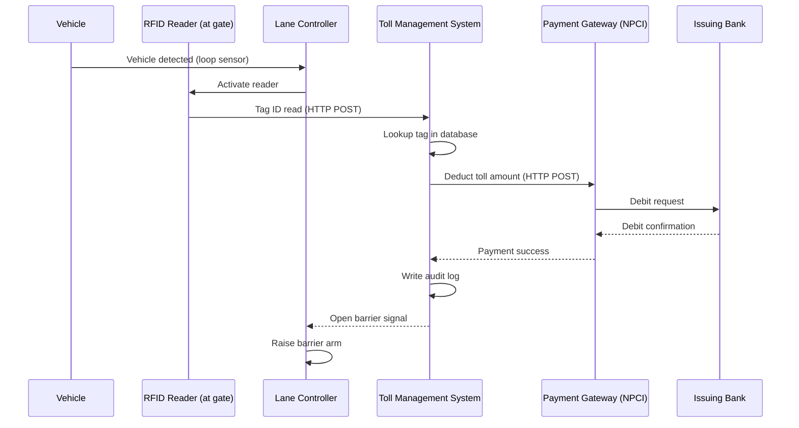

# 02 — Current State

## Purpose

Document the current system with enough detail to identify root causes, not just symptoms. Architecture that fixes symptoms without addressing root causes will reproduce the same problems at scale.

---

## Current System Overview

The existing FASTag system is composed of:

1. **RFID Reader** — mounted at the toll barrier, reads tags as vehicles stop or slow to near-stop
2. **Lane Controller** — a local embedded unit that receives signals from the reader and controls the barrier arm
3. **Toll Management System (TMS)** — a central backend that processes tag reads, calls the payment gateway, logs transactions, and issues barrier commands
4. **Payment Gateway (NPCI)** — external service connecting the TMS to issuing banks for balance deduction
5. **Manual Override Terminal** — a booth-side terminal for operators to override failed transactions

---

## Current State Process Flow

---

## Root Cause Analysis

### RC-1: Reader Positioned at the Barrier

The RFID reader is mounted at the barrier itself. The vehicle must be within 30–50cm of the reader for reliable detection. This means:

- The vehicle must stop or near-stop before a read attempt
- There is no opportunity to begin processing before the vehicle arrives
- A failed first read triggers a retry loop at zero-distance, which is the worst position for RFID signal quality

**Impact:** 2–4 seconds of lost pre-processing time per vehicle. At volume, this compounds.

### RC-2: Fully Synchronous Processing Chain

All processing — tag lookup, payment authorization, audit logging — happens in a single synchronous chain in the critical path. The barrier cannot open until every step completes.

- Tag lookup: ~200ms
- Payment gateway round-trip: **1,500–45,000ms** (varies significantly)
- Audit write: ~150ms
- Network jitter and retries: variable

The payment gateway is the dominant latency source and is outside ABC Company's control.

**Impact:** In 95th percentile conditions, the payment gateway alone accounts for 2+ minutes of wait time.

### RC-3: No Offline Capability

If the payment gateway is unavailable or slow (which happens during bank maintenance windows, peak settlement hours, and network degradation), the TMS has no fallback. Every vehicle either waits for the timeout or triggers manual intervention.

There is no local cache of balances, no deferred authorization model, and no graceful degradation path.

**Impact:** A 5-minute payment gateway outage creates a 30+ minute lane recovery time due to accumulated queue.

### RC-4: Single Point of Failure at the Reader

Each lane has one RFID reader. There is no redundancy. Reader failures — caused by hardware faults, weather, or vehicle interference — are discovered when the queue forms, not before.

There is no health monitoring of readers, no predictive maintenance signal, and no automatic fallback to an upstream reader.

**Impact:** A single reader fault per lane per day translates to 15–40 minutes of disruption per incident.

### RC-5: Audit Logging in the Critical Path

Transaction audit records are written synchronously before the barrier signal is sent. This is likely a compliance-driven implementation decision, but it introduces unnecessary latency.

Audit durability can be achieved through an event-driven append to a write-ahead log without blocking the barrier signal.

**Impact:** 100–300ms per transaction, every transaction, with no business benefit.

### RC-6: No Observability

The current system produces no structured telemetry. Delays are discovered by operators watching queues form. Root causes are identified by manual log inspection after the fact.

There is no way to distinguish between:
- Network latency to the payment gateway
- Backend processing delay
- Reader hardware degradation
- High vehicle arrival rate

Without this visibility, every optimization attempt is based on assumption rather than measurement.

---

## Current State Failure Modes

| Failure | Detection Method | Recovery Time | Impact |
|---|---|---|---|
| Reader hardware failure | Operator observation | 10–40 min | Full lane shutdown |
| Payment gateway timeout | Transaction timeout (2+ min) | Per-vehicle | Queue buildup |
| Backend TMS crash | Operator observation | 15–60 min | All lanes affected |
| Network loss at toll site | Operator observation | Variable | Manual-only mode |
| Tag balance insufficient | TMS response | 30s–2min | Lane blocked |
| Tag not registered | TMS response | Manual | Lane blocked |

---

## Current State Metrics (Estimated)

Precise metrics do not exist because there is no observability infrastructure. These are based on operational reports and NHAI complaint data:

| Metric | Estimated Value |
|---|---|
| Average processing time | 3–5 minutes |
| P95 processing time | 8+ minutes |
| Manual intervention rate | ~12–18% of transactions |
| Tag read failure rate | ~5–8% (first-read) |
| Payment gateway timeout rate | ~3–5% |
| Lane availability (uptime) | ~94% (estimated) |

---

## What the Current State Tells Us

The current architecture has three fundamental properties that must change:

1. **Reactive** — it waits for vehicles to arrive before starting any work
2. **Sequential** — it chains every step into a single critical path
3. **Opaque** — it produces no signal that would allow proactive intervention

The target architecture must be **proactive**, **parallel**, and **observable**. These three properties are not optional enhancements — they are the mechanism through which the 30-second target is achieved.

---

## Related Documents

- [01 — Business Problem](01-business-problem.md)
- [03 — Assumptions](03-assumptions.md)
- [04 — Target Architecture](04-target-architecture.md)
- [ADR-002 — Event-Driven Processing](../adr/ADR-002-Event-Driven-Processing.md)
